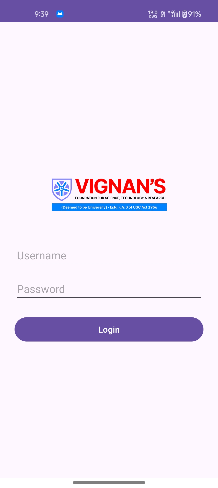
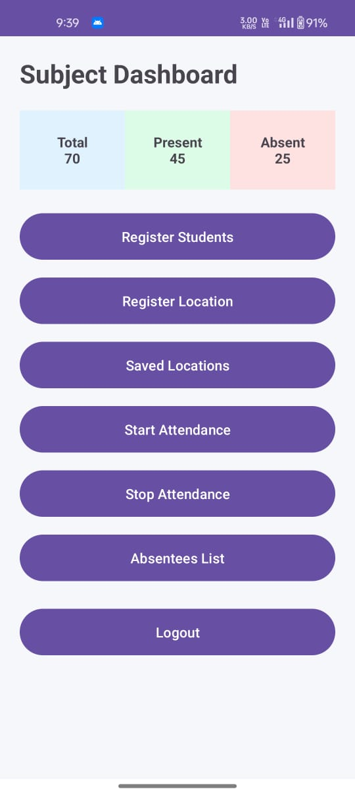
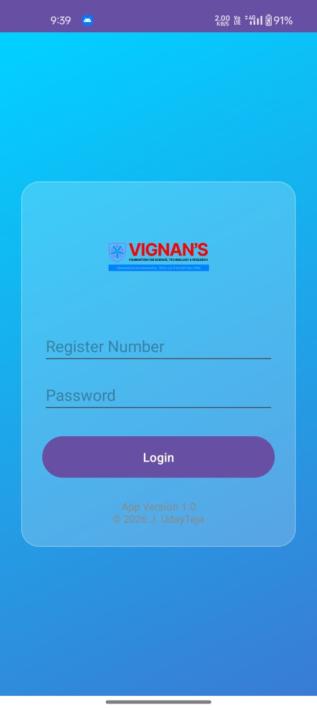
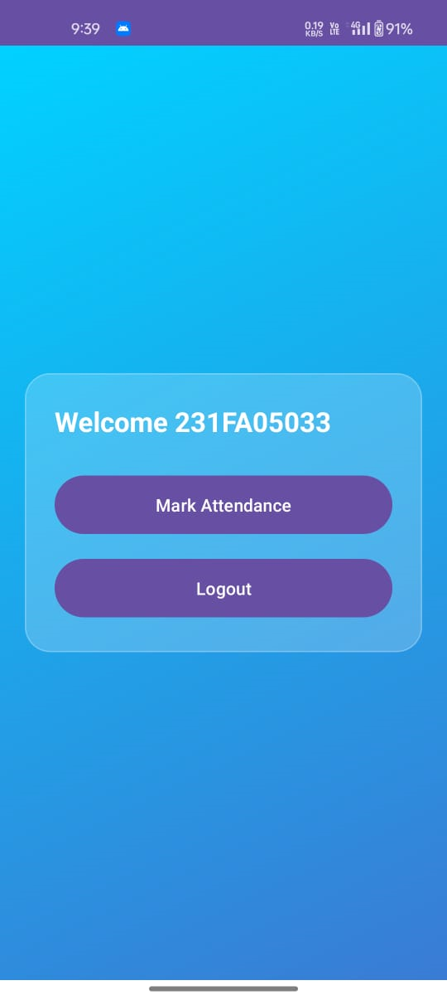

# 📱 Smart Attendance System

Android-based attendance system using GPS and security features.

## 👨‍🏫 Admin App
- Create attendance sessions
- Set geofence location
- Manage students

## 🎓 Student App
- Login with reg no & password
- Biometric authentication
- Attendance only inside class location

## 🔐 Features
- One student → one device
- Multi-subject support
- Strong geofencing
- Firebase integration

## 🛠️ Tech Used
- Kotlin
- Firebase Firestore
- Android Studio
## 📸 Screenshots

## 👨‍💻 Developer
J. UdayTeja
